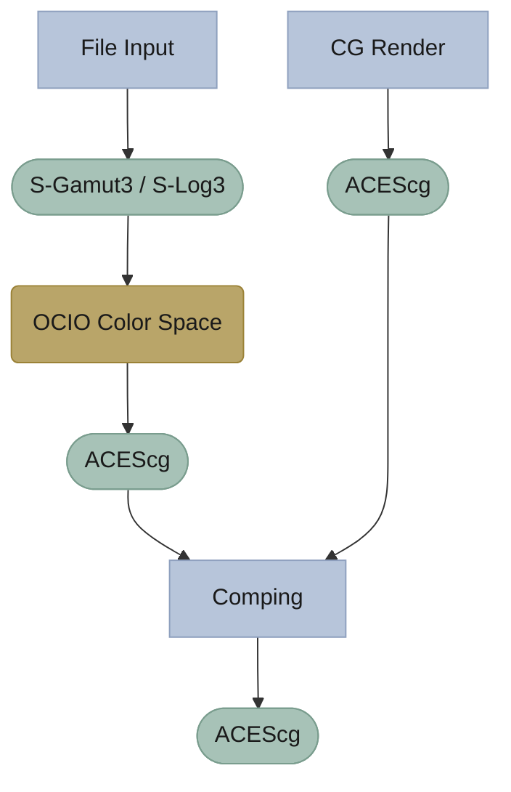
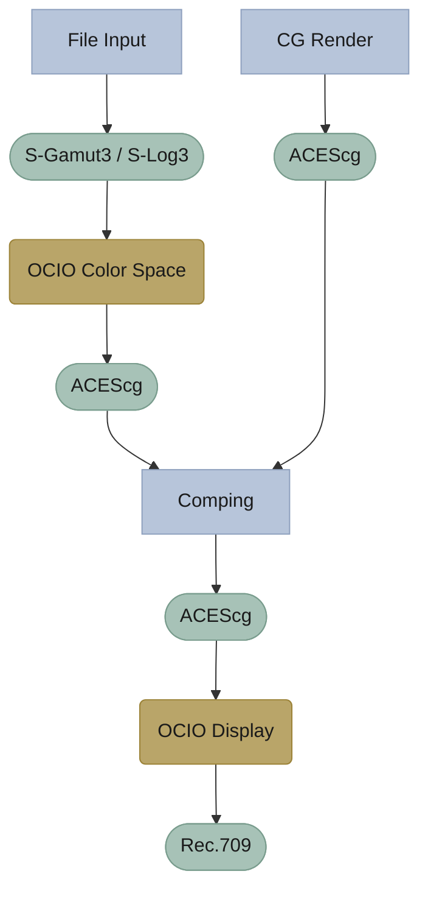
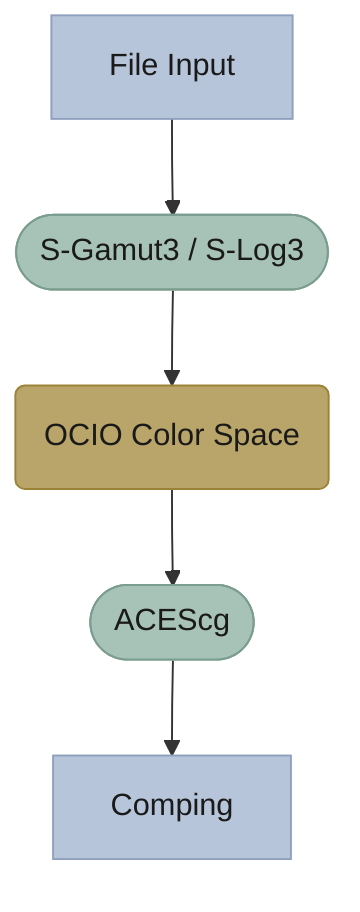
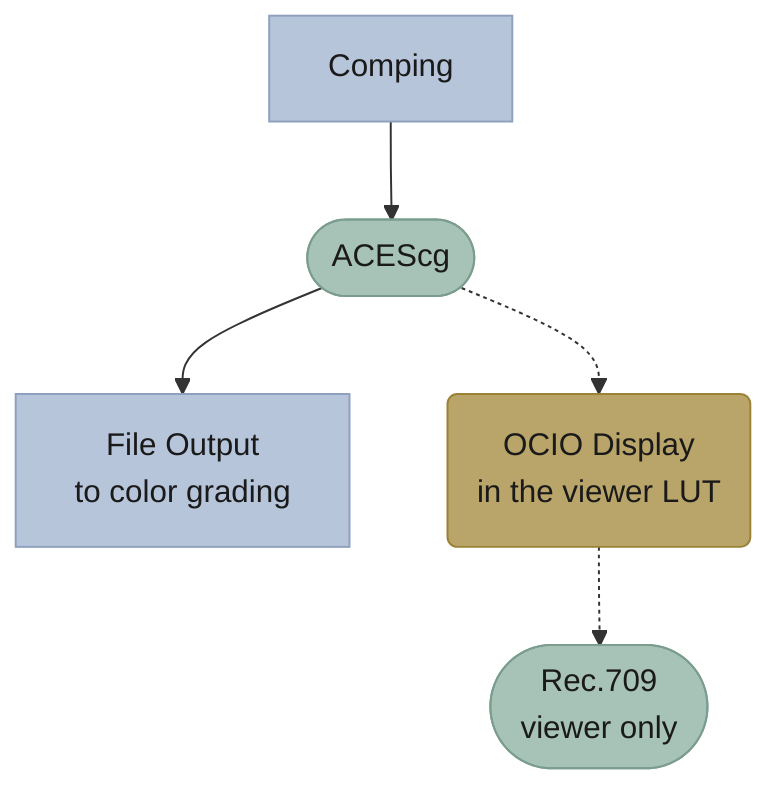
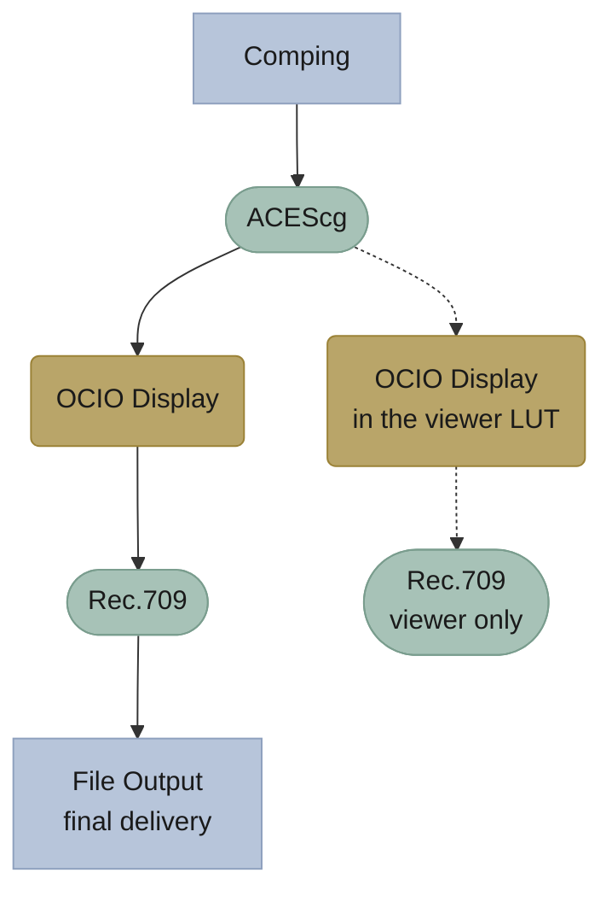

---
tags:
  - post
Summary: How to properly color-manage your 3D rendered images inside of Fusion using OCIO and ACES. Common misuses of OCIO Color Space and OCIO Display nodes.
image_cover: "[[OCIO Display Controls.png]]"
draft: false
---
![[OCIO Display.png]]

I'm getting really tired of people on YouTube trying to explain how to color manage a scene in Fusion and giving wrong information, it's not that complicated !

The confusion comes from a lack of understanding of scene-referred vs. display-referred. If you don't know the difference, read this first: [Chris Brejon, *CG Cinematography*, Chapter 1: Color Management](https://chrisbrejon.com/cg-cinematography/chapter-1-color-management/).

Most of the information in those videos is right, but they mix up the tools of Fusion's OCIO toolbox, so *mettons les points sur les i*.

If you don't want to read all of this, you can go to the end: [[#What does all this mean?]]

| Situation                    | OCIO node        | Where it goes                                                               |
| ---------------------------- | ---------------- | --------------------------------------------------------------------------- |
| Mapping a plate              | OCIO Color Space | At the input of your graph, to convert the plate to the working color space |
| Comp, then color grading     | OCIO Display     | In the viewer LUT                                                           |
| Final delivery out of Fusion | OCIO Display     | At the end of your graph, plus in the viewer LUT while comping              |

---
# OCIO vs ACES

- **OCIO** (OpenColorIO): the container in which you load an ACES config.
- **ACES**: a way to describe how to go from one color space to another. It usually comes as an OCIO config file (`.ocio`), the one you load in your DCC.

Almost every DCC uses OCIO today: Blender, C4D, Max, Unreal… I'm not going to explain why you should work in an ACES pipeline; many people who are way smarter than me explain it much better:

- [Chris Brejon, *CG Cinematography*](https://chrisbrejon.com/cg-cinematography/)
- [Cinematic Color](https://cinematiccolor.org/)

> [!warning]
> These links are rabbit holes. Don't spend too much time there, or you'll end up going crazy.

What I want to talk about here sits in the realm of CG rendering: you export an image sequence from a DCC and you want to color manage it properly. Everything I say here also applies to other color-managed applications.

---
# OCIO in Fusion

The mistake I want to address, and the one I see most often, is the misuse of the OCIO toolbox inside Fusion: `OCIO Color Space` (OCC) and `OCIO Display` (OCD).

> I'm pretty sure some engineer at BMD actually had OCD when naming this fucker.

## OCIO Color Space

As the name implies, this node does one thing: it takes a color space and converts it into another.

![[Color Space Transform.png]]

The term "color space" is a bit loose here, as it actually covers two or three things:

- the gamut (ACES AP1, S-Gamut3, Rec.709…);
- the transfer function (Linear, S-Log3, ACEScct…);
- the white point (but that's too deep for this article).

This node lets you load a config file and transform an image from one space defined in that config to another space defined in that same config. The config is nothing more than a spec sheet telling the software: "Here's a color space named `Colorspace_1` and here are its properties, and here's a second one named `Colorspace_2`, with its own properties." All OCIO Color Space does is the math to go from `Colorspace_1` to `Colorspace_2`, nothing more. (Your config can also define looks, if you want.)

I want to emphasize that this is a purely technical node: it doesn't care whether your image is scene-referred or display-referred. This matters, because that's exactly where the confusion comes from.

## OCIO Display

This node does the same thing as the previous one, with one tweak that makes all the difference.

![[OCIO Display Controls.png]]

When working scene-referred, you need a way to compress the full dynamic range of your image (which holds real-world values: sunlight, bright headlights…) into values your poor monitor can display. This step is called ***tone mapping***, and it's exactly what this node does on top of the color space transform. One node moves you from one space to another; the other applies the final display transform to your comp.
### **Using OCIO Color Space**:

`OCIO Color Space` can be used to convert a camera color space into your working color space, such as ACEScg (which is nothing more than AP1 primaries with a linear transfer function, essential for clean compositing work).

Let's say you shot a plate on a Sony camera that gives you an S-Gamut3/S-Log3 image, while your comp and 3D renders are in ACEScg. The solution: add an OCIO Color Space right after loading the plate into your graph, to go from that scene-referred log state to your working color space, here ACEScg, a scene-referred linear state. This way, everything ends up in the same color space:

### Using OCIO Color Space**:

**`OCIO Display`** usually goes at the very end of your graph, when you're ready to move to the display-referred world (Rec.709, DCI-P3…). That gives something like this:

Where you place this node really depends on the type of pipeline you're in. You shouldn't put an OCIO Display at the end of your graph if you're supposed to deliver in ACEScg, for example. However, if you're sure no further tweaks will be made to your image down the road, you can (and should) bring it back to a display standard, and therefore use an OCIO Display in the graph.

---
# Doing it properly in Fusion

Why choose when you can have both? Fusion has a great feature called the viewer LUT:
![[Display LUT.png]]

You can think of it as a filter placed in front of your screen. Whatever is shown in the viewer passes through this LUT, but only for display, so nothing gets baked into your pipeline. It's actually a supercharged LUT, because you can use any of Fusion's color management tools as your display transform. You can use a standard `.cube` LUT, but also, and this is where it gets interesting, OCIO Display!

![[OCIO Display Lut Dropdown.png]]

Once OCIO Display is selected, use the Edit button to set the path to your OCIO config, if it isn't already set through your environment variables.

![[OCIO Display Settings view LUT.png]]

This way, your whole comp is done in ACEScg and your exports stay in ACEScg, while the viewer shows the right image for your screen.

> [!tip]
> To enable it by default, right-click in the viewer and choose **Settings > Save Defaults**.

![[Save Default View LUT.png]]

---
# Why this matters

You might say: "OK, great, one does tone mapping and the other doesn't. But I can still go back to Rec.709 using an OCIO Color Space, so what's the problem?"

The problem lies in the values. Let's take an example: a basic scene from the Blender library, rendered to ACEScg with Blender's OCIO config, as a 16-bit float EXR with DWAA compression.

## The OCIO Color Space way

### In the viewer LUT

Let's set the viewer LUT to an OCIO Color Space (ACEScg → Rec.709/2.4) and check the values:

![[OCIO CS LUT .png]]

With an OCIO Color Space in the viewer LUT, the values stay the same as in the original image: nothing is touched. Even though the image is now displayed with Rec.709 primaries, the luminance values are still above 1, so they clip in the viewer. Again, this doesn't touch the signal in your comp, only what the viewer shows: since we're using the viewer LUT, the image itself remains in the same state.

### In the graph

Now let's disable the viewer LUT, add an OCIO Color Space node to the graph with the same settings (ACEScg → Rec.709/2.4), and check the values:

![[OCIO CS.png]]

We're still above 1: around 1.4 for R, G and B. The maximum luminance has indeed changed, but no real tone mapping is being applied here. If we exported this as a final delivery file, we'd end up with exactly what we see in the viewer: clipped highlights.

## The OCIO Display way

### In the viewer LUT

Let's set the viewer LUT to an OCIO Display (ACEScg → Rec.709/2.4) and check the values:

![[OCIO Display LUT.png]]

The values remain untouched, so we're still scene-referred, but the viewer displays a tone-mapped image. This is perfect if you want to export a scene-referred comp for color grading, for example.

### In the graph

![[OCIO Display.png]]

Using an OCIO Display in the graph gives the same picture as before, but now the signal itself is squeezed down to a display-referred state. Only do this to deliver your final image, when no further processing will be applied down the line.

---
## What does all this mean?

- With **OCIO Color Space**, the values stay above 1 and the image clips, wherever you put it: in the viewer LUT or in the graph. You should use an OCIO Color Space only to make scene-referred images match in terms of colorspace.
- With **OCIO Display** in the viewer LUT, you keep a scene-referred pipeline while seeing the correct display transform. And if you don't plan to make any more adjustments to your image, you can also add it at the very end of your graph.

**OCIO Color Space must not be used to tone-map images to display-referred: it isn't made for that. Use an OCIO Display instead.**

# Quick guide

It all depends on what you want to do. Here's a quick guide to help you:

| Situation                    | OCIO node        | Where it goes                                                               |
| ---------------------------- | ---------------- | --------------------------------------------------------------------------- |
| Mapping a plate              | OCIO Color Space | At the input of your graph, to convert the plate to the working color space |
| Comp, then color grading     | OCIO Display     | In the viewer LUT                                                           |
| Final delivery out of Fusion | OCIO Display     | At the end of your graph, plus in the viewer LUT while comping              |

^quick-guide-table

**Mapping a plate**

**Comp, then color grading**

**Final delivery out of Fusion**

