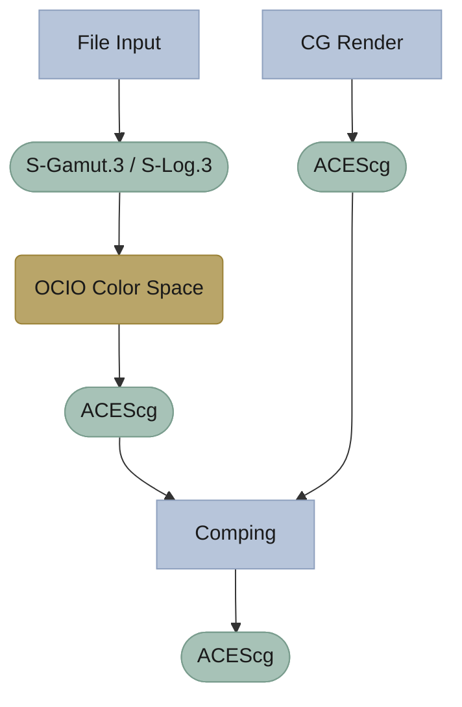

---
tags:
  - post
Summary:
image_cover:
draft: false
---
I'm starting to get really tired of people in YouTube trying to explain how to color manage a scene in Fusion and giving wrong information. 

The confusion comes from a lack of understanding of scene-referred vs. display referred. If you don't know the difference, read this: https://chrisbrejon.com/cg-cinematography/chapter-1-color-management/

Most of the information in those videos are right, but they mismatch the OCIO toolbox inside of Fusion, so "mettons le points sur les I."

# OCIO vs ACES

- OCIO: Open Color IO -> The container in which you put an ACES `config`
- ACES: a way to describe how to go from a "colorspace" to another -> usually comes as an ACES `.config` file. (The one you put in OCIO).

Almost every DCC today uses OCIO, Blender, C4D, Max, Unreal... I'm not going to explain why you should work using an ACES pipeline, many people who are way smarter than me explain it much better: 
- https://chrisbrejon.com/cg-cinematography/
- https://cinematiccolor.org/

> ⚠️Those links are rabbit holes, don't spend to much time here, or you'll end-up crazy.

What I want to talk about now, is in the realm of CG rendering, you export from a DCC an image sequence and you want to properly color manage it. All I say here is valid for other color-management applications.

# OCIO in Fusion

The error I want to address here, and the one I see the most often is the the mis-use of the OCIO toolbox inside of Fusion: `OCIO Color Space(OCC`) and `OCIO Display(OCD)`

> I'm pretty sure some engineer at BMD actually had OCD when naming this fucker.

#### `OCIO Color Space`:

As the name implies, this node does one thing. It takes a color-space and change it into another. 

![[Color Space Transform.png]]

The use of colorspace here could be more precise, as it implies 2 or 3 things:
- We talk about the gamut(ACES AP1, S-Gamut.3, Rec.709)
- And the transfer function(Linear, S-Log.3, ACEScct, …)
- (And white point, but too deep for this article).

This node allows you to load a `.config` file and make the transformation from an space defined in the said config to another space defined in the said config. The config is nothing more than a spec sheet saying to the software: "Here's a colorspace named "Colorspace_1" and are its properties, and here a second colorspace "Colorspace_2", with its properties." Then, what OCIO Color Space does, is just the math to transform "Colorspace_1" to "Colorspace_2", nothing more. (You can have a look defined in you config too if you want...).

I want to emphasize on the fact that this is a technical node, and that it doesn't care whether your image is scene-reffered or display referred. This is very important, because the confusion is coming from that. 

- `OCIO Display`: this node does the same thing than the previous one, but with one tweak that makes the whole difference. 

![[OCIO Display Controls.png]]

When working in scene-refered you need a way to compress the whole dynamic of your virtual image(representing world like values: sunlight, bright head-lights) into values your poor monitor can display. This step is called tone-mapping and this is exactly what this node does in addition to the colorspace transform.

That's the difference between OCIO Color Space and OCIO Display. One is for moving one space to another and the other does the final display transform of you comp.

For example:
- OCIO Color Space can be used to convert a camera color-space into your working colorspace like ACEScg for example. (Which is nothing more than AP1 primaries with a linear transfer function, essential for clean compositing work)
	- Let's say you shot a plate with a Sony camera outputting you an S-Gamut.3/S-Log.3 image but your comp and 3D render is in ACEScg. The solution: you'd use a OCIO Color Space just after importing your plate to your graph to change the colorspace from a scene-referred log state to your working color-space, here ACEScg, a linear scene-referred state of your image. This way, everything ends up using the same colorspace:

